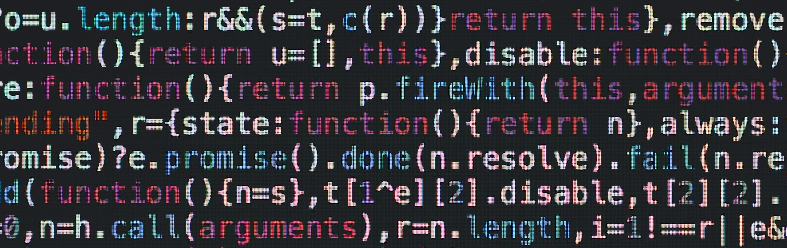

# Алгоритмические задачи

Алгоритмические задачи курса [**_"Алгоритмы и структуры данных"_**](https://levelup.htmlacademy.ru/algorithms)

---

### **Самый частый элемент**


Задача —  найти, сколько раз встречается самый частый элемент в объединении двух отсортированных по возрастанию массивов. Элементы могут повторяться.

Примеры:

`countMostFrequent([1, 2, 2, 3], [0, 2, 4, 4]) => 3`
`countMostFrequent([], [0, 0]) => 2`

Реализация функции в файле `src/js/frequent.js`.

[DEMO](https://alekseeva-t-v.github.io/algorithmic-tasks/frequent-element.html)

---
### **Задание с числами в тесте IQ**


Задача —  написать функцию для прохождения типового задания с числами в тесте iq — из списка чисел найти то, которое отличается по чётности от остальных, и вернуть его позицию.

Примеры:

`iqTest("2 4 7 8 10") => 3`

`iqTest("1 2 1 1") => 2`

Реализация функции в файле `src/js/testiq.js`.

[DEMO](https://alekseeva-t-v.github.io/algorithmic-tasks/testiq.html)

---
### **Валидация скобочных выражений**



Задача —  в данном нам тексте нужно провалидировать, что все скобки корректно расставлены. Например, (((())())) является корректной расстановкой, а ()( — нет.

Примеры:

`validateparenthesis('(((())()))') => true`

`validateparenthesis('())') => false`

Реализация функции в файле `src/js/validateparenthesis.js`.

[DEMO](https://alekseeva-t-v.github.io/algorithmic-tasks/validateparenthesis.html)

---
### **Аврал в офисе**


Офис X работает по правилам коворкинга: каждый сотрудник может работать из дома или приходить в офис. В спокойные дни в офисе тихо, приходят пара-тройка людей. А ближе к релизам/отчетным периодам/другим завалам людей гораздо больше, но все сотрудники всё равно никогда не выходят. 

Начальство хочет какое-то время понаблюдать, сколько же человек максимум приходят в офис, чтобы сократить количество «посадочных мест» и меньше платить за аренду. Для этого они наладили систему, которая фиксирует время захода и выхода людей из офиса, и планируют из этих данных получить максимальное количество присутствующих сотрудников в день. Система эта сохраняет нужные данные в формате [времяВхода, времяВыхода] для каждого сотрудника. Если люди входят и выходят одновременно, считается, что выход происходит раньше (уходящий человек уже встал с места и освободил его, а входящий ещё не успел занять). 

Задача — написать функцию, получающую из информации в системе максимальное количество одновременно находящихся сотрудников в офисе.

Примеры:

`count([]) // 0`

`count([[1, 5], [5, 10]]) // 1`

`count([[1, 5], [0, 1], [4, 5]]) // 2`

`count([[1, 10], [5, 6], [2, 3], [7, 8]]) // 2`

`count([[1, 2], [1, 10], [4, 9], [8, 15], [5, 6], [8, 16]]) // 4`

Реализация функции в файле `src/js/rushhourinoffice.js`.

[DEMO](https://alekseeva-t-v.github.io/algorithmic-tasks/rushhourinoffice.html)

---
### **Бинарный поиск**


На входе имеем отсортированный в алфавитном порядке список из растений. Необходимо написать функцию, которая будет бинарным поиском искать позицию переданного в неё растения.

Примеры:

`binarySearch(plants, "Пион") => 5`

`binarySearch(plants, "Роза") => null`

Реализация функции в файле `src/js/binarysearch.js`.

[DEMO](https://alekseeva-t-v.github.io/algorithmic-tasks/binarysearch.html)

### **Поиск игрока с одинаковым количеством очков**


Онлайн игра «Удар легенд» имеет ранговый режим, при котором игроки соревнуются между собой. Игрок может попасть в одну из пяти лиг в зависимости от счёта: чем номер лиги выше, тем лучше.

Перед тем, как попасть в лигу, игроки должны отыграть пять калибровочных игр, а до завершения пятой они не знают, на какое место и какую лигу претендуют. Аналитики хотят добавить в экран завершения игры новую опцию: показывать игрока с точно таким же рейтингом, как у текущего игрока в момент калибровки. Таким образом, игроки будут примерно представлять, в какую лигу и в какое её место они попадут после калибровки.

Каждый из игроков в рейтинге представлен следующим объектом:

```JavaScript
{
  "login": "LuckyWasTaken",
  "leaguePoints": 9001
}
```

А сам рейтинг — массив из лиг, которые тоже представляют собой массивы с игроками (это объекты, описанные выше). Например, вот таблица со счётами четырех игроков, по два в каждой лиге

```JavaScript
[
  [
    {
      "login": "stypeano",
      "leaguePoints": 23
    },
    {
      "login": "rstrazir",
      "leaguePoints": 42
    }
  ],
  [
    {
      "login": "kinerber",
      "leaguePoints": 322
    },
    {
      "login": "eridarma",
      "leaguePoints": 1337
    }
  ]
]
```

Тогда, если по окончании одного из матчей у игрока 322 очка, на экране завершения игры мы должны показать, что он — претендент в начало второй лиги.

Задача — реализовать функцию для поиска по таблице лидеров, которая на вход принимает количество очков и непосредственно таблицу, а возвращает объект:

```JavaScript
{
  "league": 1,
  "placement": 1,
}
```

Где `league` — это номер лиги (осторожно, люди считают с единицы, в отличие от индексации массива), а `placement` — место в лиге (с конца, ведь лучшие игроки в массиве лиги идут после худших).

То есть если игрок набрал при калибровке 322 очка, то функция должна вернуть:

```JavaScript
{
  "league": 2,
  "placement": 2,
}
```

Реализация функции в файле `src/js/searchscore.js`.

[DEMO](https://alekseeva-t-v.github.io/algorithmic-tasks/searchscore.html)

---
### **Уменьшение вложенности массива**


Есть массив с элементами и другими массивами — вложенность может быть любой. Нужно устранить вложенность, сохранив очерёдность элементов. Необходимо решить задачу с помощью рекурсии!

Примеры:

`flat([]) // []`

`flat([[1, 5], 5, 10]) // [1, 5, 5, 10]`

`flat([1, 2, [3, 4]]) // [1, 2, 3, 4]`

`flat([1, 2, [3, 4, [5, 6, [7, 8, [9, 10]]]]]) // [1, 2, 3, 4, 5, 6, 7, 8, 9, 10]`

Реализация функции в файле `src/js/flatarray.js`.

[DEMO](https://alekseeva-t-v.github.io/algorithmic-tasks/flatarray.html)

---

### **Числа Фибоначчи**


Необходимо создать функцию для получения числа из последовательности Фибоначчи по индексу. Первое её число — 0, второе — 1, а каждое последующее — сумма двух предыдущих.

Примеры:

`fibonacci(1) // 0`

`fibonacci(2) // 1`

`fibonacci(13) // 144`

Реализация функции в файле `src/js/fibonacci.js`.

[DEMO](https://alekseeva-t-v.github.io/algorithmic-tasks/fibonacci.html)

---

### **Рекурсивный бинарный поиск**


Необходимо определить присутствует элемент в массиве или нет  (оптимизированный includes на сортированном массиве). Необходимо использовать бинарный поиск по новым условиям, с помощью рекурсии.

Примеры:

`binarySearch([], 3) // false`

`binarySearch([3], 3) // true`

`binarySearch([1, 2, 3, 4, 5], 4) // true`

`binarySearch([1, 2, 3, 5, 6], 4) // false`

Реализация функции в файле `src/js/binarysearchincludes.js`.

[DEMO](https://alekseeva-t-v.github.io/algorithmic-tasks/binarysearchincludes.html)

---

### **Поиск игрока с одинаковым количеством очков**


В игре, помимо лиг, доступны и гильдии, по которым также существуют свои таблицы лидеров. Технологи очень хотят, чтобы похожие по счёту игроки искались не только внутри лиг, но и внутри гильдий — вдруг игроки захотят вступить в гильдии с игроками с похожим счётом?

Имея счёт игрока, нужно найти в таблице лидеров для гильдий игрока с таким же счётом и вернуть его название гильдии и место в гильдии.

Как и в случае с лигами, это «отсортированная матрица», только сортировка немного другая. Гильдии отсортированы сверху вниз по счёту самого «слабого» из их игроков. А внутри гильдии все игроки отсортированы по количеству очков. Важное уточнение: в отличие от лиг, в таблице лидеров для гильдий в каждой гильдии находится одинаковое количество участников, то есть матрица является прямоугольной.

Ваша задача — реализовать функцию для поиска по таблице лидеров, которая на вход принимает количество очков и непосредственно таблицу, а возвращает объект:

{ "guild": "seabass", "placement": 1, }

Где guild — это название гильдии , а placement — место в гильдии.

Примеры:

`searchScore(data, 4) => {
  "guild": "seabass",
  "placement": 4,
}`

`searchScore(data, 14) => null`

Реализация функции в файле `src/js/searchscoreguild.js`.

[DEMO](https://alekseeva-t-v.github.io/algorithmic-tasks/bsearchscoreguild.html)